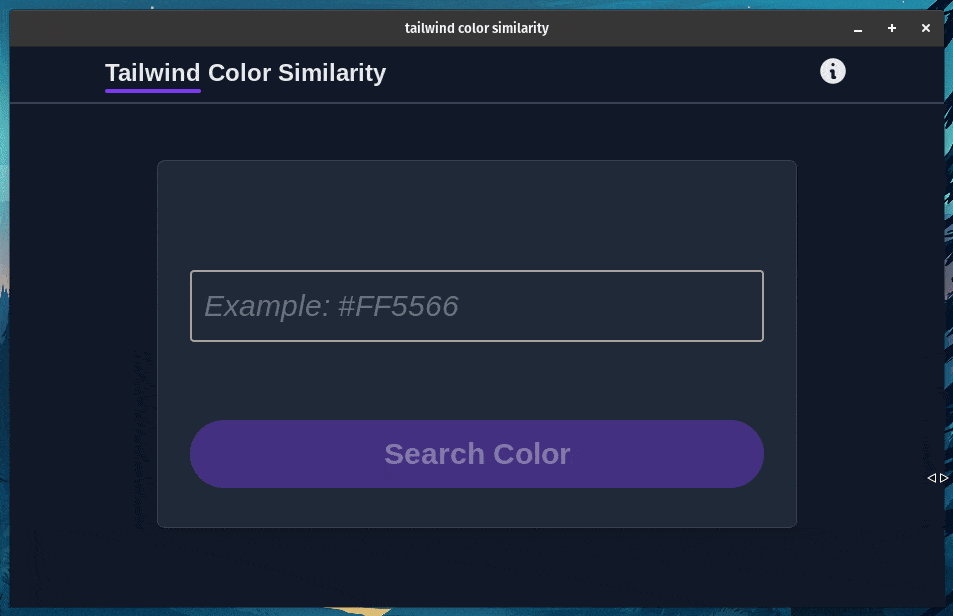

# tailwind-color-similarity
A desktop application used to compare the similar color on tailwindcss via using RBG value. Very useful in the situation where to recreate the existing component.
 

---

## Stack
It is created using those amazing technologies:
- [Svelte](https://svelte.dev/)
- [Tailwind](https://tailwindcss.com/)
- [Tauri](https://tauri.studio/)
- And many others!

---

## License
>You can check out the full license [here](https://github.com/hafizhaziq307/tailwind-color-similarity/blob/main/LICENSE)

This project is licensed under the terms of the **MIT** license.
